# Introduction to Reinforcement Learning Using Custom PyGame

## Caveat Emptor: Known Issues

Before proceeding further, this topic has been raised first to ensure that anyone trying to run these notebooks, will be **adequately forewarned**.

There are known file system issues with running the PyGame PIP modules and the notebook PyGame using the Google Colab notebook.

For more information, please see [Special Instructions](#special-instructions)

## Summary

This project provides proof-of-concept application of Reinforcement Learning models on a custom PyGame.
The model uses the data from the game state and rewards to decide on actions

This proof-of-concept shows that the models tried to adapt their decisions to the reward system
* Models shows more decisive movement within the context of the game
* Model average scores tended to be lower which appears to be tied to going after higher/riskier rewards
* More tuning improvements can be done

**Recommendation**: Move to Phase II and apply models to more complex simulations/games or tools.

## Goal: Proof Of Concept Application of Reinforcement Learning

#### Original problem: 

* Create a simulation game where actors within the game/simulation would learn adaptive behaviors from experience and improve performance.  

#### Reset to more realistic expectations: 

* Do a proof-of-concept to see if a few widely available reinforcement learning models can be applied to a simple game.

#### Realistic Phase I
* Develop a simple PyGame application 
* Identify and apply a few of the widely available Reinforcement Learning models that can be trained to figure out how to play the game
* Understand basic reinforcement learning concepts
* Evaluate if the model can improve behavior with minimal intervention from humans

## Data: The Pygame Itself

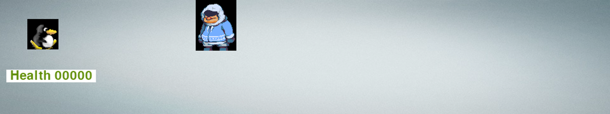

**The PyGame application is the "data" itself.**  

* The Reinforcement Learning model engages with the game as a player
  * The machine inputs actions to the game
  * The game outputs observations which will include environment state and reward information
    * In terms of the game, this means a snapshot of the player positions at a moment and the reward for an action taken
  * The machine inputs those observations to determine the policy: weighting the expected outcomes with desired outcome  
    
### Data Engineering

A number of different scenarios were used in tuning the model.  

#### Duration

* Game times were adjusted to 5, 10, and 30 second durations for exploration
* Increasing the time limit did not noticeably improve results
* Final results use the 5 second game version.  
* Testing was limited by hardware constraints (memory)

#### Rewards

| State feature | Reward  |
|---|----|
| Player moves left or right within image bounds | +10 points |
| Player moves in a region close to the "Enemy" | + 25 points |
| Player collides with "Enemy" | -100 |

#### Some Exploratory Variations

* High collision penalty '-1000' points -> agent never recovered
* No risk reward - agent would -> agent would lurk around one side of the screen avoiding "Enemy"
* Adjust final cumulative reward
   * Add more negative points if score < 0
   * Add more positive points if score > 0
   * No real difference seen

## Reinforcement Learning Basic Concepts
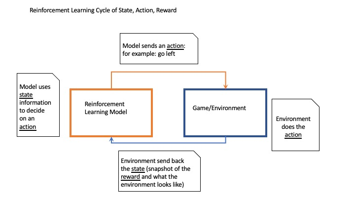

The player/model gets feedback of the success of its chosen actions in the form of rewards.  In this particular case, the rewards were the points per individual action, until the end.

At the end, the Kaggle tutorials suggested giving the model the cumulative reward, so the model would see if it had been successful.

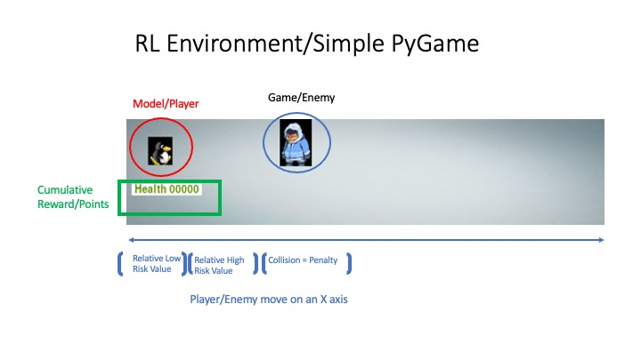

This section is just intended to give people a very high level conceptual view of Reinforcement Learning

## Reinforcement Learning Frameworks

Before we get into the models, let's take a look at the frameworks available to us.

2 popular frameworks were used for implementation:
* [OpenAI](https://gym.openai.com/docs/) ([PPO]() and [A2C]() models)
* [TensorFlow with TF Agents and Keras](https://www.tensorflow.org/agents) ([DQN Agent](https://www.tensorflow.org/agents/tutorials/1_dqn_tutorial))

OpenAI works with both [PyTorch](https://pytorch.org/) and TensorFlow/TFAgents

## Notebooks

In the order they appear in the slide deck:

1. [PPO RL Training](./notebooks/110_pygame_ppo.ipynb)
2. [A2C RL Training](./notebooks/120_pygame_a2c.ipynb)
3. [DQN Without Image Input](./notebooks/130_pygame_discrete_dqn.ipynb)
4. [DQN With CNN Input](./notebooks/140_pygame_cnn_dqn.ipynb)

## Special Instructions

These notebooks are set up to run on Google Colab and need access to Google Drive
* When using the PyGame code in the notebooks
    * The PIP module needs to be copied to Google Drive and then untarred
    * The pygame image dependencies are contained within the tar and will be needed by **all notebooks**
    * **Only pip install for OpenAI models**
    * [pip module tar file](./install_tars)

## Models used
| Environment | Model | Description |
|---|---|---|
| OpenAI Gym + PyTorch | PPO |Proximal Policy Optimization - Requires minimal adjustments |
| OpenAI Gym + PyTorch | A2C | Actor Critic |
| TF Agent (TensorFlow) | DQN with numeric state | Passes in distance and sprite position information + rewards to reduce memory footprint |
| TF Agent (TensorFlow) | DQN + CNN input | Puts a very basic CNN layer in front of the Q Network.  Memory restrictions limited training |

## Model performance
### Metrics

* Per [Kaggle Reinforcement Learning tutorials](https://www.kaggle.com/learn/intro-to-game-ai-and-reinforcement-learning), the recommended measurements are **averaged scores from a batch** (vs. single high/low scores)
* Baseline will be the averaged scores of an agent making random choices (basically a random walk)
* Trained model will be measured by average performance after training and video/animations of the machine's behavior to assess level of expertise

### Charts
#### Average Scores Before and After Training

These charts show the model performance before and after training. 

The key thing to note are the ranges in which the score averages mostly occur during the different iterations.

In most cases, the ranges are lower for the "after" case and most likely reflect the models trying to accommodate the higher rewards for riskier behavior.

##### PPO

**Before**

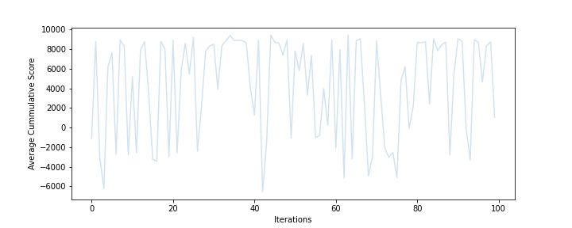

**After**

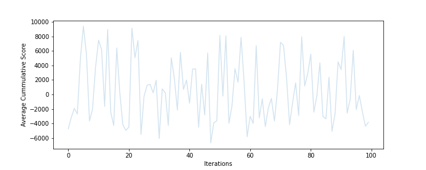

##### A2C

**Before**

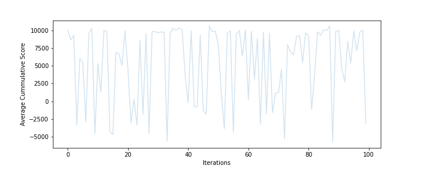

**After**

##### DQN Without Image Input

**Before**

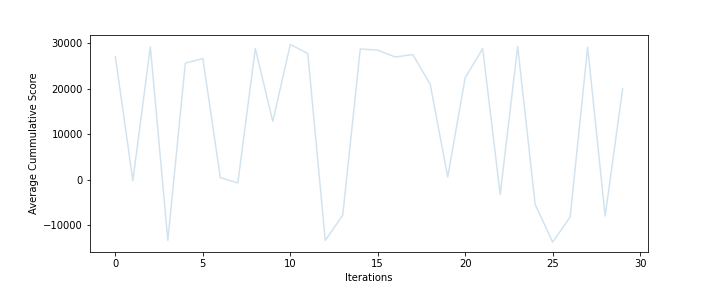

**After**

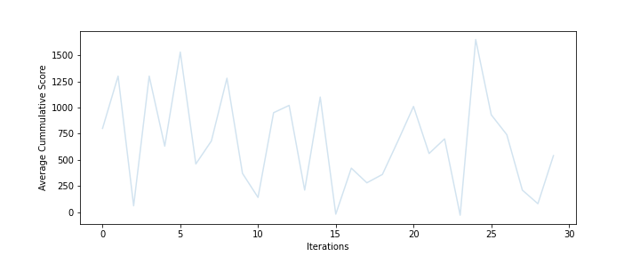

##### DQN With CNN

**Before**

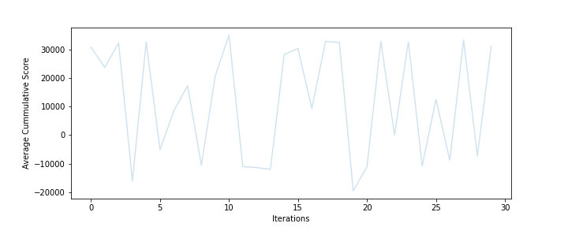

**After**

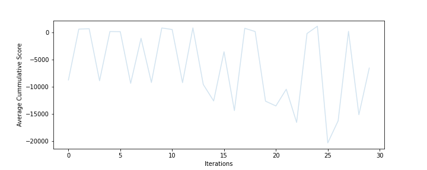

#### Average Scores During **DQN** Training
This shows the model progress during training in average scores at each evaluation point

##### DQN Without Images

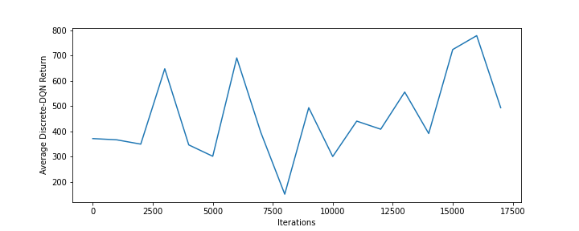

##### DQN with CNN

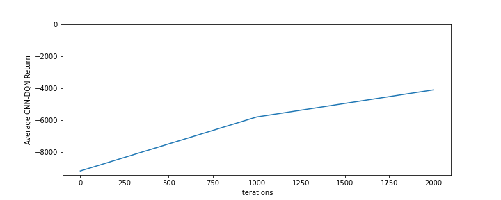

### Animations
Unfortunately the DQN videos could not be embedded in the readme.  To look at the videos, click through the links below.
#### Before Training

#### After Training 
##### PPO

##### A2C

##### DQN Without Images
[DQN Without Images Video](https://drive.google.com/file/d/1-2nC2LWS-eCGjipWvO8RQsAUCGqL-Cep/view?usp=sharing)
##### DQN With CNN
[DQN With CNN Video](https://drive.google.com/file/d/1-6UeVJ2WPSkaw56LTlPlN-Rt0bXICeCx/view?usp=sharing)

## Reports: Slide Deck
[Presentation](./reports/intro_to_rl_with_pygame.pdf)

## Conclusions

While trained models behaved less than optimally, it is clear that the models show more decisive behavior than randomly generated actions.  Due to the limited time frame of Phase I, it's clear that tuning options can be explored as well to improve performance.

GPU and Memory constraints also factored into the amount of training that could be done.

Overall, the recommendation is to move on to Phase II and evaluate applying the models on more complex simulations.

The long term goal is to move beyond games and applying the models to tools and more complex simulations.

